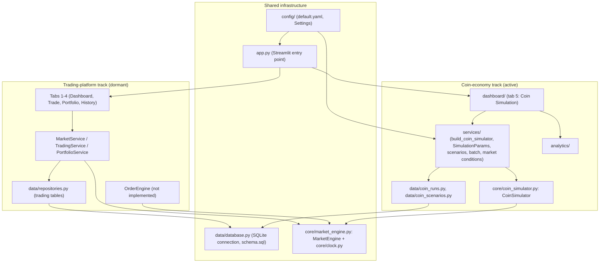
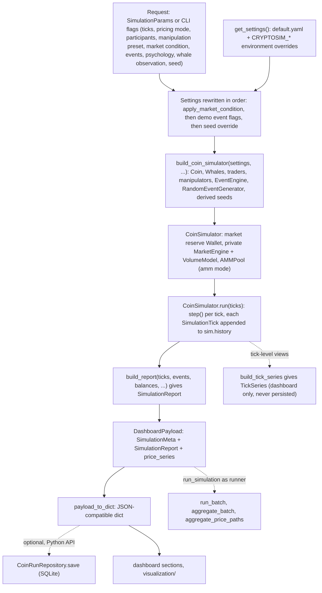

# Architecture

This document explains how the repository is put together: which code is
active, how one coin-economy simulation flows from configuration to a
result, where state lives, and which boundaries contributors must keep.
It describes the repository as it is now. For the phase-by-phase design
record (models, formulas, decisions) see [`ROADMAP.md`](ROADMAP.md); for
installation and usage see the [`README`](../README.md).

## 1. Scope and design intent

The Crypto Market Simulator is a **fictional, synthetic, educational**
simulator. Every price, balance and trade is generated inside the
process; there is no network client, no exchange connection, no real
order execution and no real money. Nothing here models a real market
accurately, and nothing here is financial advice.

The architecture is built for four things:

- **experimentation** — configurable participants, pricing modes, news,
  psychology and manipulation schemes;
- **reproducibility** — every run is determined by its inputs and one
  base seed;
- **analysis** — descriptive analytics computed from a finished run's
  recorded ticks;
- **visualization** — a Streamlit dashboard and a CLI that present those
  results.

It is not a trading or execution system.

The repository holds two tracks in one package. The **coin-economy
track is the active architecture**. The earlier **trading-platform track
is dormant**: it is kept and tested, but not developed.

## 2. Two historical tracks

| Track | Purpose | Status | Main components |
|---|---|---|---|
| Trading platform | The original multi-asset design: a price process per asset, order entry, portfolio and history | **Dormant and incomplete.** Synthetic price generation works; order matching, portfolio P&L and trade history are not implemented | `core/market_engine.py` (`MarketEngine`), `core/order_engine.py` (`OrderEngine.submit` raises `NotImplementedError`), `core/portfolio.py`, `services/market_service.py`, `services/trading_service.py`, `services/portfolio_service.py`, `data/repositories.py`, the trading tables in `data/schema.sql`, and the first four tabs of `app.py` |
| Coin economy | One fictional coin (`FIC`) traded by rule-based traders, whales and manipulators, with news, psychology, analytics, persistence, scenarios, batches, aggregate statistics, stress testing and a dashboard | **Active.** Developed from Phase 6 onward | `core/coin_simulator.py` (`CoinSimulator`), `core/traders/`, `core/liquidity/`, `core/events/`, `core/psychology/`, `core/whale.py`, `core/whale_cohort.py`, `services/coin_simulation.py` (`build_coin_simulator`), `services/simulation_params.py`, `services/scenarios.py`, `services/batch.py`, `services/market_conditions.py`, `analytics/`, `data/coin_runs.py`, `data/coin_scenarios.py`, `dashboard/`, `stress/`, `scripts/simulate_coin.py` |

(Paths in the table are relative to `crypto_simulator/` unless they start
with `scripts/`.)



Two points the diagram makes that are easy to miss:

- **`MarketEngine` is shared, not dormant-only.** It is the trading
  platform's per-asset GBM price process, and `CoinSimulator` also builds
  its own private `MarketEngine` (one symbol, seeded from the run's base
  seed) as the random walk of `random_walk` pricing mode. The two tracks
  never share an *instance*: the dormant tab keeps its engine in
  Streamlit session state, and every coin run constructs a fresh one.
- **The tracks share a database file, not tables.** The coin tables
  (`coin_runs`, `coin_run_ticks`, `coin_scenarios`) sit beside the
  trading tables in the same `schema.sql`, and neither track reads the
  other's tables.

## 3. Repository structure

```text
crypto-simulator/
├── crypto_simulator/            The package (both tracks)
│   ├── app.py                   Streamlit entry point: four dormant tabs + the coin tab
│   ├── config/                  default.yaml and Settings loading (get_settings, env overrides)
│   ├── models/                  Plain data classes: Coin, Wallet (coin); Asset, Order, Trade, Account (dormant)
│   ├── core/                    The simulation itself
│   │   ├── coin_simulator.py    CoinSimulator, SimulationTick, PricingMode: the coin tick loop
│   │   ├── market_engine.py     MarketEngine: seeded GBM price process (shared)
│   │   ├── clock.py             SimulationClock: tick counter and simulated time
│   │   ├── volume_model.py      VolumeModel: random-walk background volume
│   │   ├── whale.py             Whale: large holders, funded/unfunded, behaviors, cycles, observation
│   │   ├── whale_cohort.py      WhaleCohort: shared fixed behavior timetable for funded whales
│   │   ├── traders/             TraderAgent base, organic + manipulation strategies, registry, settlement
│   │   ├── liquidity/           AMMPool (constant product, exact Decimal), pool settlement
│   │   ├── events/              MarketEvent, catalog (create_event), EventEngine, RandomEventGenerator
│   │   ├── psychology/          PsychologyState, MarketSignals, compute_psychology (opt-in)
│   │   ├── order_engine.py      OrderEngine (dormant; submit not implemented)
│   │   └── portfolio.py         PortfolioCalculator (dormant)
│   ├── services/                Turns requests and config into simulator runs
│   │   ├── coin_simulation.py   build_coin_simulator, seed offsets, manipulation presets, demo events
│   │   ├── simulation_params.py SimulationParams: the validated run request
│   │   ├── market_conditions.py bull/bear/meme configuration presets (apply_market_condition)
│   │   ├── scenarios.py         ScenarioService: save/load named SimulationParams
│   │   ├── batch.py             run_batch: one request, many derived seeds
│   │   └── market_service.py …  MarketService, TradingService, PortfolioService (dormant)
│   ├── analytics/               Post-run, read-only analytics; build_report → SimulationReport
│   ├── visualization/           Pure Plotly figure builders (import nothing from the package)
│   ├── dashboard/               The coin tab: data.py (run entry points), view.py, one *_section.py per view
│   ├── data/                    SQLite connection, schema.sql, coin-run/coin-scenario/trading repositories
│   ├── stress/                  Stress cases, invariant checks and runner (Phase 16)
│   └── utils/                   Logging setup
├── scripts/
│   ├── simulate_coin.py         The coin-simulation CLI (single run, report, scenarios, batch)
│   ├── stress_test.py           The stress-test CLI over crypto_simulator/stress/
│   └── compat/
│       └── compare_checkpoints.py  Runs the digest grid against historical git checkpoints
├── tests/                       pytest suite, mirroring the package layout
│   ├── compat/                  grid.py (digest grid), pinned_digests.json, grid and isolation tests
│   ├── scripts/                 CLI tests
│   └── analytics/ core/ dashboard/ data/ models/ services/ stress/ visualization/
├── docs/                        ROADMAP.md, PHASE_19_FINAL.md, this file
├── data/                        Local SQLite database location (only .gitkeep is tracked)
├── .github/                     CI workflow (macOS), Dependabot, pull request template
├── pyproject.toml               Package metadata, Python >= 3.12, pytest config (slow marker)
├── requirements.txt             Runtime dependency ranges
├── requirements-dev.txt         Runtime + pytest, pytest-cov
└── .env.example                 Documents the CRYPTOSIM_* process-environment overrides
```

Note that the dashboard and the stress harness are **inside the
package** (`crypto_simulator/dashboard/`, `crypto_simulator/stress/`),
not top-level directories.

## 4. Layering model

The governing rule:

> **The simulation core produces state and recorded ticks. Analytics and
> visualization observe the simulation; they never feed anything back
> into the core's decisions.**

```text
            ┌─────────────────────────────────────────────────────────────┐
 front ends │ scripts/simulate_coin.py      app.py → dashboard/view.py    │
            └──────────────┬──────────────────────────────┬───────────────┘
                           │                              │
            ┌──────────────▼──────────────┐   ┌───────────▼───────────────┐
 run entry  │ dashboard/data.py           │   │ dashboard/*_section.py    │
            │ run_simulation, batches,    │   │ → visualization/ (Plotly) │
            │ comparisons                 │   └───────────────────────────┘
            └──────┬───────────────┬──────┘
                   │               │ observes
            ┌──────▼──────┐  ┌─────▼──────────────────────────────┐
 services   │ services/   │  │ analytics/  (build_report, ...)    │
            └──────┬──────┘  └─────▲──────────────────────────────┘
                   │ builds        │ reads sim.history / ticks
            ┌──────▼───────────────┴─────────────────────────────────┐
 core       │ core/  (CoinSimulator, traders, liquidity, events,     │
            │         psychology, whales)   +  models/  +  config/   │
            └────────────────────────────────────────────────────────┘
            data/ (SQLite) is reached only through services/scenarios.py
            or a direct CoinRunRepository call — never from core/.
```

### Core simulation layer — `core/`, `models/`, built by `services/`

Owns all simulation state and every state transition: the clock, the
price process, the AMM pool, wallets and the market reserve, trader and
whale decisions and settlement, news events, psychology, manipulation
strategies, whale cohorts, and the Phase 19 crowd/breadth observation
channels. `services/` constructs the core from configuration
(`build_coin_simulator`) and adds configuration-level concepts
(manipulation presets, market-condition presets, saved scenarios,
batches) without adding a second simulation engine.

### Analytics layer — `analytics/`

Derives descriptive measurements from a finished run: market summary,
per-trader results, whale activity, event windows, psychology/market
associations, manipulation summaries and regime labels, all composed by
`build_report` into one frozen `SimulationReport`. It also holds the
cross-run reductions (`aggregate_batch`, `aggregate_price_paths`) and the
tick-level projection (`build_tick_series`). Analytics modules import
core *types* to read ticks, but nothing in `core/`, `services/`,
`config/`, `models/` or `data/` imports `analytics/`. Analytics is never
a hidden control path.

### Visualization / dashboard layer — `visualization/`, `dashboard/`, `app.py`

`visualization/` is pure Plotly figure construction and imports nothing
from the package. `dashboard/` exposes controls that *configure* a
request, runs it through `dashboard/data.py`, serializes the result, and
renders each report section. Every number on screen is a value the
report or the recorded tick series already holds; the frontend
recomputes nothing. Nothing in `core/`, `services/`, `analytics/`,
`models/`, `data/` or `config/` imports `dashboard/`.

One structural detail worth knowing: `dashboard/data.py` is also the
package's **shared single-run entry point**. `run_simulation` lives
there, and the CLI's batch mode and the stress harness both call it. It
is a front-end module that other front ends reuse, not part of the core.

### Tooling / validation layer

| Location | Role |
|---|---|
| `tests/` | The pytest suite, including structural tests that enforce the import boundaries above |
| `tests/compat/` | The compatibility digest grid (`grid.py`), its pinned digests, and tests that check the working tree against them |
| `scripts/compat/compare_checkpoints.py` | Runs the same grid against archived historical checkpoints in fresh subprocesses |
| `crypto_simulator/stress/` + `scripts/stress_test.py` | Runs demanding but valid (or deliberately invalid) configurations through the ordinary entry points and checks completion, finite values and conserved accounting |
| `.github/workflows/ci.yml` | Runs the test suite, slow tests, checkpoint comparison and coverage on macOS |

The tooling exercises the simulator; it does not extend it. The package
never imports `tests` or `scripts` (enforced by
`tests/compat/test_compat_isolation.py`).

## 5. Active coin-economy data flow

The path every single run takes, verified against
`dashboard/data.py` (`_execute`) and `scripts/simulate_coin.py`:



Notes on the flow:

- **Configuration is rewritten, not extended.** Market conditions,
  `--events`/`--random-events` and `--seed` all produce a modified copy
  of `Settings` (`dataclasses.replace`) before the builder sees it. The
  builder is the only place configuration becomes objects.
- **Two callers of the same steps.** `dashboard/data.py` (`_execute`,
  behind `run_simulation` and `run_dashboard_simulation`) and the CLI's
  single-run path in `scripts/simulate_coin.py` each perform the
  settings rewrite → `build_coin_simulator` → `sim.run` →
  `build_report` sequence; the CLI prints ticks as it goes and builds
  the report only with `--report`. `tests/dashboard/test_integration.py`
  requires the two to agree bit for bit. The CLI's **batch** mode does
  not repeat the steps: it passes `run_simulation` to `run_batch`.
- **Balances are read around the run.** Each trader's starting
  `(cash, coins)` is read before `run` and the ending one after, because
  the report's P&L needs both; this is a read, not a mutation.
- **`simulation_id`** is a BLAKE2b hash of the request and the seed
  actually used, so the same request always has the same id.
- **Timestamps are excluded from the payload.** `SimulationClock` is
  anchored to wall-clock time, so the payload uses tick numbers as its
  time axis.

## 6. Simulation tick / run loop

`CoinSimulator.run(ticks)` calls `step()` `ticks` times. `step()`
dispatches on `PricingMode` to one of two separate code paths and
appends the resulting frozen `SimulationTick` to `self.history`. The
order below is taken from `_step_random_walk` and `_step_amm`.

### `random_walk` mode (default)

1. **Events.** If the simulation has an `EventEngine`, the
   `RandomEventGenerator` (if any) may inject an event for the coming
   tick, then `EventEngine.state(tick)` gives the tick's `EventState`.
2. **Psychology** (only with `psychology=True`). `compute_psychology`
   turns `MarketSignals` into one market-wide `PsychologyState`. Price
   terms come only from *completed* closes; news terms from this tick's
   `EventState`.
3. **Random walk.** The private `MarketEngine` steps (advancing the
   clock). With events, its volatility is scaled by the event state and
   a drift of `drift_per_sentiment × sentiment` is applied
   (`drift_per_sentiment` defaults to 0).
4. **Background volume** from `VolumeModel`.
5. **Whale cohorts** (if any) move member whales to this tick's phase of
   their shared timetable, using the tick number only.
6. **Whales**, in list order: each may trade at the running price (a
   funded whale settles against the market reserve); the price is
   multiplied by the trade's impact and the volume increased. With
   `whale_observation=True`, a read-only `WhaleObservation` is recorded.
7. **Traders.** One shared `MarketContext` (a `PsychologyContext` when
   psychology is on) is built at the post-whale price, carrying
   aggregate sentiment/attention and, if enabled, the previous tick's
   crowd flow. Each trader decides on that snapshot (with breadth
   enabled, a per-trader copy adds leave-self-out breadth) and fills
   against the market reserve at that price. Manipulators are ordinary
   entries at the end of the trader list; a `WASH` decision settles as
   two self-cancelling legs.
8. **Trader price impact.** The traders' net signed flow applies one
   more multiplicative impact factor.
9. **Record.** The adjusted price is synced back into `MarketEngine` so
   the next tick compounds from it, the close is recorded, and a
   `SimulationTick` is returned.

### `amm` mode

1. **Events** and **psychology**, exactly as above.
2. The clock advances. There is **no random walk** and no background
   volume.
3. **Traders** all decide on the same pre-trade pool spot price, then
   swap through the `AMMPool` in list order, so each swap moves the price
   later traders execute at. Wash decisions route through the pool as
   two legs.
4. **Record.** Price is the pool's spot price after the swaps; volume is
   the coins actually swapped; the tick carries a `PoolState` snapshot.

AMM mode **rejects** whales, whale cohorts and a nonzero
`drift_per_sentiment` at construction, so in AMM news reaches price only
through trader reactions.

### What is optional

| System | Switched on by | Default |
|---|---|---|
| Whales | `coin.whales` in config (`--no-whales` removes them) | on in `default.yaml`, random-walk only |
| Traders | `coin.traders` (`--no-traders` removes them) | on |
| Manipulators | `coin.manipulators` or a manipulation preset (`--scenario`) | none |
| Scheduled / random events | `coin.events`, `--events`, `--random-events`, market conditions | none |
| Psychology | `psychology=True` / `--psychology` (not a config field) | off |
| Whale observation | `whale_observation=True` / `--whale-observation` | off |
| Whale cohorts | `CoinSimulator(whale_cohorts=...)` (Python API only) | none |
| Crowd / breadth channels | `build_coin_simulator(crowd_*, breadth_*)` (Python API only) | off |

## 7. State, events and boundaries

**Simulation state** lives on the `CoinSimulator` instance for the
lifetime of one run:

- the clock and the private `MarketEngine`/`VolumeModel` (and their RNG
  streams);
- every trader's and funded whale's `Wallet`, plus each participant's
  own seeded RNG and strategy state;
- the market reserve `Wallet` that trades settle against;
- the `AMMPool` reserves (AMM mode), with exact `Decimal` accounting;
- the `EventEngine` timeline (scheduled and randomly generated events);
- the rolling windows of recent closes used for trader price history and
  psychology signals;
- `history`, the list of recorded `SimulationTick`s.

**An event** in this codebase means a **news event**: a `MarketEvent`
with a category, severity, start tick, duration and decay. The engine
reduces the events live on a tick to an aggregate `EventState`
(sentiment, attention, volatility multiplier, per-event status). Events
never set a price: they reach the market through trader contexts and, in
random-walk mode, the walk's volatility and optional drift.

**State over time.** Each tick produces one immutable `SimulationTick`
(price, market cap, volume, whale trades, trader trades, pool state,
event state, psychology state, whale observations). Downstream consumers
read the recorded ticks plus a few end-of-run facts (the event list,
which event ids were random, opening and closing balances). They do not
read live simulator internals mid-run.

**Persistent vs. ephemeral.**

| Boundary | Lifetime |
|---|---|
| A `CoinSimulator` and its `history` | In memory, one process; never checkpointed or resumed |
| `SimulationReport`, `DashboardPayload`, `TickSeries` | In memory; the payload can be serialized and optionally saved |
| SQLite coin tables | Persistent, but written only on an explicit save |
| Saved scenarios | Persistent, written only by `--save-scenario` |
| Batch results | In memory only; a batch writes no database row |
| Streamlit `st.session_state` | Per browser session; holds the serialized payload, tick series, batch and comparison views |

Running a simulation does **not** persist it. A run is saved only when
code explicitly calls `CoinRunRepository.save`.

## 8. Analytics and observer architecture

> Analytics are observational. They do not feed derived measurements
> back into the simulation's decision state.

Every analytics function takes recorded output — a sequence of
`SimulationTick`s, or a batch result — and returns frozen, descriptive
results. Unavailable figures are `None`, not zero.

| Area | Module(s) | Entry point |
|---|---|---|
| Price, returns, volatility, drawdown, volume decomposition, AMM pool activity | `analytics/market.py` | `analyze_market` |
| Per-trader / per-strategy fills, flows, fees, P&L | `analytics/traders.py` | `analyze_traders` |
| Whale behavior and activity (needs whale observation) | `analytics/whales.py`, `analytics/whale_activity.py` | `analyze_whales`, `analyze_whale_activity` |
| News-event windows | `analytics/events.py`, `analytics/event_windows.py` | `analyze_events`, `analyze_event_windows` |
| Psychology and its same-tick / lag-1 associations | `analytics/psychology.py`, `analytics/psychology_market.py` | `analyze_psychology`, `analyze_psychology_market` |
| Manipulation (from the simulator's own labels) | `analytics/manipulation.py` | `analyze_manipulation` |
| Descriptive regime labels over fixed windows | `analytics/regimes.py` | `analyze_regimes` |
| The unified report and its text rendering | `analytics/report.py`, `analytics/rendering.py` | `build_report`, `render_report` |
| Tick-level columns for the dashboard charts | `analytics/tick_series.py` | `build_tick_series` |
| Batch statistics | `analytics/aggregate.py` | `aggregate_batch`, `aggregate_values` |
| Cross-run per-tick price bands | `analytics/price_paths.py` | `aggregate_price_paths` |
| Shared series helpers (returns, percentile convention) | `analytics/_series.py` | — |

`build_report` composes the market, trader, whale-activity,
event-window, psychology-market, manipulation and regime analyses into a
`SimulationReport`. The CLI's per-run printouts additionally call
`analyze_events`, `analyze_whales` and `analyze_psychology` directly.

**Enforced by tests.** The direction of dependency is checked
structurally, for example:

- `tests/analytics/test_events_simulation.py::test_nothing_in_the_simulator_imports_analytics`
  — no module under `core/`, `services/`, `config/`, `models/` or
  `data/` imports `analytics`;
- `tests/dashboard/test_data.py::test_nothing_in_the_simulator_imports_the_dashboard`
  — no module under `core/`, `services/`, `analytics/`, `models/`,
  `data/` or `config/` references `crypto_simulator.dashboard`;
- `tests/dashboard/test_data.py::test_the_data_layer_computes_no_analytics`;
- `tests/data/test_coin_runs.py::test_a_simulation_is_identical_whether_or_not_it_is_persisted`;
- several analytics tests asserting that analysing a run leaves the run
  (RNG streams included) unchanged.

Inside the simulator there are also *observation* features — whale
observation and the Phase 19 crowd/breadth observations — which are
recorded or placed on trader contexts during the run. They are core
features, not analytics; with every response sensitivity at zero (the
default) a run with them on is identical to the same run with them off.

## 9. Dashboard architecture

**Launch.** `streamlit run crypto_simulator/app.py`. `app.py` sets up the
page, opens the configured SQLite database (`get_connection`, which runs
`init_db`) for the dormant tabs, and renders five tabs. The first four
belong to the dormant track: **📊 Dashboard** advances a session-held
`MarketEngine` one tick at a time through `MarketService` and draws a
candlestick chart; **💱 Trade**, **💼 Portfolio** and **🧾 History** only
show "coming soon". The fifth, **🪙 Coin Simulation**, calls
`dashboard.view.render_dashboard()`. The coin tab uses neither that
database connection nor the dormant `MarketEngine`.

**Run path.** `view.py` reads its widgets into a validated
`SimulationParams` and calls one of three runners in `dashboard/data.py`:

| Panel | Runner | What is kept in session state |
|---|---|---|
| Single run | `run_dashboard_simulation` → `DashboardRun` (payload + `TickSeries`) | serialized payload and tick series |
| Batch runs (1–200) | `run_dashboard_batch` → `run_batch` + `reduce_batch` → `DashboardBatch` | serialized reduced batch only (metrics, failures, `AggregateStatistics`, price-path bands) |
| Scenario comparison | `plan_comparison`, then `run_dashboard_comparison` → `ScenarioComparison` | one reduced batch per configuration |

Each panel has its own run button, status and error keys in
`st.session_state`, so one panel never clears another's results. A
failed run clears its panel's previous result instead of leaving stale
figures on screen.

**Rendering.** Results are converted to JSON-compatible data by
`dashboard/serialization.py` (`to_jsonable`), then rendered by one
module per section: `market_section`, `trader_section`, `whale_section`,
`event_section`, `psychology_section`, `manipulation_section`,
`regime_section`, `tick_section` (synthetic OHLC candles from tick
prices, volume by component, recorded pool and event state),
`batch_section` (summary, metric ranges, price-path bands, histograms)
and `comparison_section` (side-by-side spreads per configuration, in
selection order, never ranked). Figures come from `visualization/`
(`charts.py`, `tick_charts.py`, `batch_charts.py`,
`comparison_charts.py`). `formatting.py` holds the display formatting.

**Current limitations** (verified in `view.py`):

- The single-run and batch panels have **no market-condition control**;
  `_params_from_widgets` never sets `market_condition`. Only the
  comparison panel offers market conditions.
- There is **no scenario save/load** in the dashboard; only the CLI uses
  `ScenarioService`.
- The dashboard **does not save runs**; nothing in `dashboard/` calls
  `CoinRunRepository`.
- Runs are synchronous inside one Streamlit rerun, which is why ticks
  are capped at `MAX_TICKS` (2000), batches at
  `MAX_DASHBOARD_BATCH_RUNS` (200) and comparisons at
  `MAX_COMPARISON_RUNS` (400 simulations).
- The Phase 19 crowd/breadth channels and whale cohorts have no
  dashboard control.

## 10. Batch and scenario architecture

### Scenario save/load

The word "scenario" has two meanings in this codebase:

- a **manipulation preset** — `pump_and_dump` or `wash_trading` in
  `MANIPULATION_SCENARIOS` (`services/coin_simulation.py`), selected by
  the `scenario` field of a request;
- a **saved scenario** — an entire `SimulationParams` stored under a
  user-chosen name.

Saved scenarios are layered as:

```text
scripts/simulate_coin.py  --save-scenario / --load-scenario
          │
services/scenarios.py      ScenarioService: SimulationParams ⇄ dict, validation on load
          │
data/coin_scenarios.py     CoinScenarioRepository: rows + JSON (params_json)
          │
SQLite table coin_scenarios  (database.path, default data/simulator.db)
```

A saved scenario holds the request's fields: ticks, pricing mode,
traders/whales flags, manipulation preset, market condition, events,
random events, psychology, whale observation and the seed actually used.
It holds no results. Loading rebuilds the request and runs it from tick
one; it is not a checkpoint. On the CLI, typed flags override the loaded
values. Only the CLI uses saved scenarios.

### Batch simulation

`services/batch.py` provides `run_batch(params, runs, *, runner,
base_seed=None, settings=None)`:

- **The runner is injected.** The batch layer never runs a simulation
  itself; both the CLI and the dashboard pass
  `dashboard.data.run_simulation`.
- **Seeds.** The base seed is the explicit `base_seed`, else the
  request's `random_seed`, else the configured
  `simulation.random_seed`; it is never drawn. Run *i* uses
  `base_seed + i × BATCH_SEED_STRIDE` (10,000), so runs never share a
  seed with another run's participants.
- **Serial and in memory.** Runs execute in index order. A run that
  raises is recorded in its `BatchRun` and the batch continues.
- **Bounds.** `MIN_BATCH_RUNS`–`MAX_BATCH_RUNS` (1–1000) in the service;
  the dashboard caps at 200.
- **Results.** A `BatchResult` holds one `BatchRun` (index, seed,
  payload or error) per run. `aggregate_batch` reads each run's
  `MarketSummary` fields into `AggregateStatistics`, and
  `aggregate_price_paths` produces per-tick price bands. The dashboard
  reduces the result immediately (`reduce_batch`) and drops the
  payloads.
- **Nothing is stored.** A batch writes no database row.

A dashboard **scenario comparison** is one batch per configuration
(pricing mode × manipulation preset × market condition), all from one
shared base seed, so corresponding runs across configurations use the
same derived seeds.

## 11. Persistence boundaries

| Data / artifact | Persistence mechanism | When used | Notes |
|---|---|---|---|
| A running simulation (`CoinSimulator`, `history`) | None (process memory) | Every run | Never checkpointed; cannot be resumed |
| Finished coin run | SQLite `coin_runs` + `coin_run_ticks` via `CoinRunRepository` | Only on an explicit `save(payload)` call — Python API only | Stores metadata, per-tick price/market cap/volume, request and report as JSON text. Not stored: fills, event records, pool reserves, per-participant state, tick series |
| Saved scenario | SQLite `coin_scenarios` via `ScenarioService` / `CoinScenarioRepository` | `--save-scenario` / `--load-scenario` on the CLI | Inputs only, including the seed |
| Dormant trading-platform data | SQLite trading tables (`assets`, `accounts`, `holdings`, `orders`, `trades`, `price_history`) via `data/repositories.py` | The dormant **📊 Dashboard** tab writes `price_history` bars as it ticks | Not used by the coin track |
| Batch / comparison results | None | CLI `--batch`, dashboard batch and comparison panels | Held in memory (CLI) or reduced into session state (dashboard) |
| `TickSeries` | None | Dashboard single run | Never persisted, never rebuilt from a saved run |
| Dashboard results | `st.session_state` | Per browser session | Lost when the session ends |
| Stress outcomes | None | `scripts/stress_test.py`, pytest | Printed or asserted; nothing persisted |
| Compatibility pins | `tests/compat/pinned_digests.json` (git-tracked) | pytest and `compare_checkpoints.py` | Repository artifact; changed only deliberately with `--write-pins` |
| Builder fingerprints | `FINGERPRINTS` in `tests/compat/grid.py` (git-tracked) | pytest | Repository artifact |
| Configuration | `crypto_simulator/config/default.yaml` (git-tracked) + `CRYPTOSIM_*` process environment | Every run | The simulator does not read a `.env` file |
| Coverage reports | `.coverage`, `htmlcov/` (gitignored); CI uploads `coverage-html` | Coverage runs | Generated, not part of the architecture |

The database file is `database.path` (default `data/simulator.db`, or
`CRYPTOSIM_DB_PATH`). `data/*.db` is gitignored, so stored runs and
scenarios stay local. `init_db` uses `CREATE TABLE IF NOT EXISTS` and
never drops existing data.

## 12. Reproducibility and compatibility architecture

**Where seeds enter.** One base seed per run: `simulation.random_seed`
from configuration, overridden by `--seed`, the dashboard seed control,
a saved scenario, or a batch's derivation. `build_coin_simulator`
derives every other stream from it with fixed offsets:

| Stream | Seed |
|---|---|
| Price process (`MarketEngine` inside `CoinSimulator`) | base |
| Background volume (`VolumeModel`) | base + 1 |
| Whale *i* | base + 100 + *i* |
| Trader *i* (organic, then preset followers) | base + 1000 + *i* |
| Manipulator *i* | base + 2000 + *i* |
| Random-event generator | base + 3000 |
| Batch run *i* (base of that run) | batch base + 10,000 × *i* |

Each consumer owns its own `random.Random`; there is no global random
state in the simulation path. Market-condition presets rewrite settings
and draw nothing. AMM accounting uses exact `Decimal` arithmetic.

**Compatibility tooling** is kept apart from ordinary tests because it
answers a different question. Ordinary tests check that behavior is
*correct*; the compatibility grid checks that behavior is *unchanged* —
that fixed seeded runs still reduce to the same SHA-256 digests they
produced at historical checkpoints.

- `tests/compat/grid.py` runs fixed seeded simulations and CLI
  invocations and digests everything they produce (timestamps
  excluded). It imports only the standard library, PyYAML and the
  package under test, so it can run against archived source.
- `tests/compat/pinned_digests.json` holds the pinned digests per level,
  plus superseded digests under `calibrations` for deliberate behavior
  changes (Phase 18's `psychology-momentum-horizon` is the first).
- `tests/compat/test_compat_grid.py` checks the working tree against the
  pins and the two builder fingerprints (`random_walk`, `amm`).
- `scripts/compat/compare_checkpoints.py` extracts each historical
  checkpoint commit with `git archive` and runs the grid against it in a
  fresh subprocess. It therefore **needs the full git history** — a
  shallow clone lacks the checkpoint commits (CI checks out with
  `fetch-depth: 0`). It is not run by pytest.

**Platform constraint.** Bit-for-bit reproduction is verified on
**macOS** with **Python 3.12+**, and CI runs only on macOS runners.
Same-seed results are not guaranteed to match across platforms (Linux
floating-point results can differ in the last bit and the simulation
amplifies that). Python 3.11 is unsupported because its float `sum()`
produces a different AMM fingerprint.

Detailed reproducibility instructions are planned for a later Phase 22
step in `docs/REPRODUCIBILITY.md` (not yet written).

## 13. Experimental and deliberately limited areas

### Phase 19 crowd and breadth channels

`build_coin_simulator` accepts `crowd_observation`, `crowd_response`,
`crowd_direction`, `breadth_observation` and `breadth_response`. These
channels are:

- **experimental** research switches from the Phase 19 realism
  experiments;
- **off by default**, and inert unless a response sensitivity is
  switched on;
- **Python API only** — no CLI flag, dashboard control, config field or
  `SimulationParams` field;
- **not evidence of herding.** Phase 19 established bounded individual
  responses to aggregate crowd information (including a retail-only
  response to leave-self-out breadth). It did **not** establish
  participant-to-participant propagation, cascades or market-wide
  herding. See [`PHASE_19_FINAL.md`](PHASE_19_FINAL.md).

### Other deliberately limited areas

- **Whales in AMM mode** are rejected by the simulator.
- **Whale cohorts** are a fixed shared timetable (Python API only), not
  whales reacting to the market or each other.
- **Psychology** is opt-in and not part of the config; open model-shape
  questions are recorded in the roadmap.
- **Market conditions** tilt the odds of news and drift; they do not
  decree outcomes, and their drift applies only in random-walk mode.

### Historical and archived work

- The **trading-platform track** (section 2) is dormant; its order,
  portfolio and history features are not implemented.
- The **Phase 19 AMM external-market prototype** failed its
  preregistered pre-check and is archived on the branch
  `experiment/phase19-amm-external-failed`. It is not on `main` and not
  part of the supported architecture.

## 14. Architectural invariants

Contributors should preserve these. Each is backed by the code structure
or by tests.

1. **The core is authoritative for state transitions.** Only `core/`
   (constructed by `services/`) changes simulation state. Traders return
   decisions; settlement functions move balances.
2. **Analytics stay observational.** Nothing under `core/`, `services/`,
   `config/`, `models/` or `data/` imports `analytics/`; analysing a run
   does not change it.
3. **The dashboard is an observer and a configuration surface.** Nothing
   in the simulator or analytics references `crypto_simulator.dashboard`;
   the dashboard computes no analytics of its own; a seeded dashboard
   run equals the CLI run with the same options and seed.
4. **Persistence observes.** A run is identical whether or not it is
   saved; saving is explicit and never a checkpoint.
5. **Conservation.** Coins and cash are neither created nor destroyed
   within the accounted system (exactly in AMM mode; within float
   tolerance in random-walk mode), as the stress checks verify.
6. **One seed, fixed derivation.** All randomness derives from one base
   seed through `build_coin_simulator`'s offsets and the batch stride.
   Changing an offset, the stride or the order of draws changes results.
7. **Compatibility pins change only deliberately.** Never re-pin to make
   a failing comparison pass; a deliberate behavior change is recorded
   as a calibration boundary after explicit compatibility review.
8. **Reproducibility-sensitive numerics need review.** Changes to
   floating-point summation, RNG usage, operation order or settlement
   arithmetic can move fingerprints and must be checked against
   `tests/compat/` and `compare_checkpoints.py`.
9. **The package never imports `tests` or `scripts`**, and the
   compatibility grid and comparison tool stay self-contained.
10. **The tracks stay separate.** Dormant trading-platform code is not
    part of the coin path; sharing `MarketEngine`, configuration, the
    database file or `app.py` does not make the dormant features active.

## 15. Further documentation

- [`README.md`](../README.md) — purpose, installation, quickstart,
  capabilities, testing and CI.
- [`docs/ROADMAP.md`](ROADMAP.md) — the phase-by-phase design record:
  AMM math, events, psychology, whales, analytics definitions, dashboard
  design and verification.
- [`docs/PHASE_19_FINAL.md`](PHASE_19_FINAL.md) — the Phase 19
  realism/feedback report.

Planned for later Phase 22 steps (not yet written): `docs/REPRODUCIBILITY.md`,
`docs/CLI.md`, `docs/DASHBOARD.md`.
