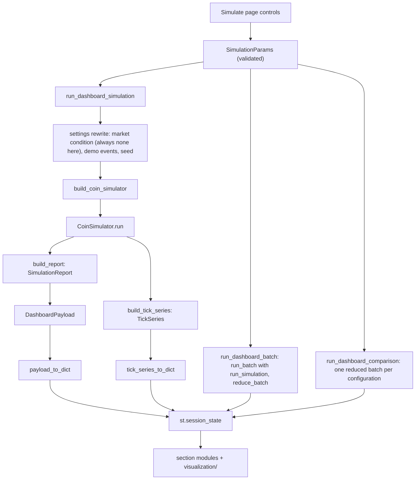

# Dashboard

The technical guide to the Streamlit dashboard: launching it, what every
control does, what each view shows, what is kept and what is lost, and
where its limits are. The [README](../README.md) has the short version.

## 1. Overview

The dashboard is a Streamlit app (`crypto_simulator/app.py`). Its
**Simulate** page, where the app opens, is a configuration and observation surface for
the active coin-economy simulator:

- you choose run options;
- the dashboard asks the simulator to run;
- it displays the finished run's analytics report and recorded ticks.

**The dashboard is not the simulation engine.** Runs happen in
`CoinSimulator` (`crypto_simulator/core/coin_simulator.py`), built by
`build_coin_simulator`. Every figure on screen comes from the simulator's
recorded ticks or the `SimulationReport`. The dashboard recomputes no
analytics and feeds nothing back into a run.

Everything shown is synthetic and educational. No real exchange, real
trade, real money or real market data is involved, and nothing on screen
is a forecast or advice.

## 2. Launching the dashboard

Prerequisites: Python 3.12+ and the installed package (**`pip install .`**,
or `pip install -e .` for development; see the README). Run from the
repository root.

```bash
streamlit run crypto_simulator/app.py
```

On the first interactive launch on a machine, Streamlit stops at its own
onboarding prompt (`Email:`). Press Enter to skip it. Streamlit then
prints a `Local URL` (port **8501** by default) and opens a browser.

Headless (no browser, no prompt), for servers and checks. Both forms
were run for this document and answered `ok` on `/_stcore/health`, with
HTTP 200 on `/`:

```bash
streamlit run crypto_simulator/app.py --server.headless true
streamlit run crypto_simulator/app.py --server.headless true --server.port 8599
curl http://localhost:8599/_stcore/health      # → ok
```

Stop the server with Ctrl+C. Port behavior is Streamlit's own: if the
default port is busy, it moves on to the next one (8502 was observed). If
a port given with `--server.port` is busy, it exits with
`Port 8599 is not available`.

**Theme.** The dashboard has one dark theme (Phase 24). Two pieces make it:

- `.streamlit/config.toml` sets the page colors and hides Streamlit's
  developer menu and Deploy button (`client.toolbarMode = "minimal"`).
  Streamlit reads this file from the directory it is started in, so the
  theme applies when you launch from the repository root as shown above.
  Started from anywhere else, the app works the same but uses Streamlit's
  default look.
- `crypto_simulator/visualization/style.py` holds the design tokens
  (background, surfaces, text, accent, and the up/down colors used only
  for price direction) and the one Plotly template every chart builder
  applies. Charts are drawn with `st.plotly_chart(..., theme=None)`, so
  Streamlit's own chart theme does not repaint them.

The theme changes how figures look, never what they show: trace values,
titles, hover text and every displayed number are the same as before it.

## 3. Dashboard architecture

```text
Simulate page controls (view.py)
        ↓  SimulationParams (validated)
dashboard/data.py: run_dashboard_simulation / run_dashboard_batch / run_dashboard_comparison
        ↓  settings rewrite → build_coin_simulator → CoinSimulator.run → build_report
DashboardPayload (+ TickSeries, or a reduced DashboardBatch / ScenarioComparison)
        ↓  payload_to_dict / tick_series_to_dict / batch_to_dict / comparison_to_dict
st.session_state (JSON-compatible dicts)
        ↓
section modules (*_section.py) → visualization/ (Plotly figures)
```

- `view.py` reads the widgets into a `SimulationParams`, which validates
  them. An invalid combination becomes an on-screen error, not a crash.
- `dashboard/data.py` is the only dashboard module that reaches the
  simulator. It is the same build/run/report path the CLI uses (see
  [`ARCHITECTURE.md` §5](ARCHITECTURE.md#5-active-coin-economy-data-flow)).
- Results are serialized to plain JSON-compatible dicts
  (`dashboard/serialization.py`) and kept in the browser session's
  `st.session_state`. The section modules render only from those dicts.

## 4. Dashboard layout

Every page starts with the title **Crypto Market Simulator** and the line
"Fictional simulator — educational use only. No real exchange
connections, no real trades, no real money." The pages are Streamlit's
native navigation (`app.PAGES`), a bar at the top of the page; on a narrow
screen it folds into a menu behind the **»** button:

| Page | Track | Status |
|---|---|---|
| **Simulate** (opens first) | **Active coin economy** | Everything else in this document |
| **Legacy → Multi-asset sandbox** | Dormant trading platform | Works, minimally. Choose an asset (`BTC`, `ETH`, `SOL`), press **⏭️ Advance market by 1 tick**, and see a candlestick chart of the stored synthetic price history. It is separate from the coin simulator and has no trading |

Order entry, portfolio P&L and trade history are **not implemented**, so
the app has no page for them (until Phase 24 they were "coming soon"
tabs). Their underlying code is unchanged.

**Moving between pages keeps your run controls.** Streamlit forgets a
widget's value once a run goes by without drawing it, so a visit to the
sandbox would otherwise reset the Simulate controls while the last run's
results stayed on screen. `app.py` calls `view.retain_control_state()`
before each page, which keeps every run, batch and comparison control
(`view.RUN_CONTROL_KEYS`). Results are kept in session state as before.
Display choices inside the results (a picked trader, the OHLC window, a
metric) are not kept and return to their defaults.

The **Simulate** page is a workspace (Phase 24, Step 4): the run setup in
the sidebar, and three workflow tabs that all use it.

```text
Sidebar: Run setup
├── Market ............................... Length (ticks), Pricing
├── Participants ......................... Traders, Whales, Record whale detail
├── News and behaviour ................... Scheduled news, Random news, Trader psychology
├── Scenario ............................. Manipulation
└── Reproducibility (expander) ........... Set the random seed, Random seed

Simulation workspace
├── Single run (tab)
│   ├── [Run simulation]
│   ├── empty state, "Running simulation...", the error, or:
│   ├── Status line ...................... "Simulation complete — …", seed, run id
│   ├── Market summary ................... headline figures and the price path chart
│   └── Detail tabs ...................... Market details · Traders · Whales · Events ·
│                                           Psychology · Manipulation · Regimes · Tick data
├── Batch analysis (tab) ................. [Batch runs] [Run batch] → summary, aggregate,
│                                           price paths across runs, per-run distributions
└── Scenario comparison (tab) ............ three multiselects, runs, shared seed, plan,
                                            [Run comparison] → summary, metric ranges, median matrix
```

Each workflow has its own button, status, result and error in session
state. Running one never clears another's result. The workflow and detail
tabs only arrange what is drawn: every section is the same as before, in
the same order, and the tabs remember which one is open across reruns.

## 5. Single-run controls

These controls are verified against `view.py` and a rendered app. They
are the sidebar's **Run setup**; the batch and comparison tabs reuse them,
as described below. Labels and option names are display text only: each
control keeps its widget key and stores the same value as before (for
example, **Pricing** shows "Random walk" and stores `random_walk`).

| Group | Control | Widget key | Default | Values / range | Effect | Notes |
|---|---|---|---|---|---|---|
| Market | **Length (ticks)** | `coin_dashboard_ticks` | 20 | 1–2000 (`MAX_TICKS`) | Number of ticks to simulate | |
| Market | **Pricing** | `coin_dashboard_pricing_mode` | Random walk | Random walk (`random_walk`), Liquidity pool (AMM) (`amm`) | Random walk or constant-product AMM pool | AMM with **Whales** on shows a warning in the setup and fails with the simulator's error if run |
| Participants | **Traders** | `coin_dashboard_traders` | on | on/off | Include `coin.traders` | Preset participants are always included |
| Participants | **Whales** | `coin_dashboard_whales` | on | on/off | Include `coin.whales` | Turn off for AMM |
| Participants | **Record whale detail** | `coin_dashboard_whale_observation` | off | on/off | Records whale state each tick | Needed for the Whales tab |
| News and behaviour | **Scheduled news** | `coin_dashboard_events` | off | on/off | The two-event demo schedule | The same as `--events` |
| News and behaviour | **Random news** | `coin_dashboard_random_events` | off | on/off | Random news, probability 0.1 per tick | The same as `--random-events` |
| News and behaviour | **Trader psychology** | `coin_dashboard_psychology` | off | on/off | Participant psychology | The same as `--psychology` |
| Scenario | **Manipulation** | `coin_dashboard_scenario` | No manipulation | No manipulation (`none`), Pump & dump (`pump_and_dump`), Wash trading (`wash_trading`) | Adds a manipulation preset's participants | The same as CLI `--scenario` |
| Reproducibility | **Set the random seed** | `coin_dashboard_seed_override` | off | on/off | Off: use the configured seed. On: use **Random seed** | |
| Reproducibility | **Random seed** | `coin_dashboard_seed` | the configured seed (`42` by default) | 0–4294967295 | The run's base seed | Disabled while **Set the random seed** is off |
| (Single run tab) | **Run simulation** | `coin_dashboard_run` | — | — | Runs once with the setup | |

The controls take effect **only when Run simulation is pressed**. If you
change a control afterwards, the results on screen still describe the
previous run until you press it again, and a note above them says the
run setup has changed since this run (it disappears if the controls are
set back, or after the next run). The status caption names the pricing
mode, seed and run id of the run being shown.

There is **no** market-condition control here. Section 13 lists what
cannot be configured.

## 6. Single-run results

Before any run, the Single run tab says there are no results yet and
where to set up a run; no figures or charts are shown.

After a run, the status line reads "Simulation complete — *N* of *N*
requested ticks, *N* analysed". Its caption shows the coin, pricing mode,
seed and **run id** (`simulation_id`). Below it, **Market summary** shows
the headline figures (close price, return, total volume, ticks analysed)
and the **price path chart**. The return appears once, as **Return**. On a
narrow screen the four figures wrap onto a second line rather than being
cut off. The figure rows inside the detail tabs wrap the same way: each
figure is as wide as its own label and value, so a long label such as
"Share of participant volume" is shown whole at any width, and a phone
still fits two short figures side by side. The seven report sections follow in the
detail tabs (the rest of the market section is **Market details**; the
tick-level views are **Tick data**), each rendered from the matching part
of `SimulationReport`:

| Section | What it shows | Source | Notes |
|---|---|---|---|
| **Market summary** + **Market details** | Headline figures and the **price path chart** (high/low marked); then price figures, **Volume** table, **Volatility and drawdown**, **Market cap and turnover**, **AMM pool activity**, **Market statistics** | `report.market` + recorded `price_series` | The AMM block shows a note in random-walk runs |
| **Traders** | **Strategies**, **Trader activity**, **Trader performance**, **Trader detail** (pick a trader) | `report.traders` | P&L comes from start and end balances |
| **Whales** | **Whale activity**, **Recorded tick outcomes**, **Behavior**, **Allocation and targets**, **Cohorts**, **Whale detail** | `report.whale_activity` | Needs **Whale observation**. Otherwise it explains why it is empty (AMM, whales off, or not observed) |
| **Events** | **Event timeline**, **Event windows**, **Categories**, **Event detail** | `report.event_windows` | Needs news events |
| **Psychology** | **Recorded psychology components** chart, **Components**, **Threshold occupancy**, **Persistence**, **Associations**, **Market averages by component level**, **During event windows** | `report.psychology_market` | Needs **Psychology** |
| **Manipulation** | **Manipulation kinds**, **Pump-and-dump**, **Wash trading**, **Manipulation beside organic activity** | `report.manipulation` | Identified from the simulator's own labels |
| **Market regimes** | Volume-per-tick chart by window, **Regime windows**, **Window figures**, **Recorded alongside each window**, **Label distribution** | `report.regimes` | Descriptive labels over fixed windows |

All of these are **single-run** views. When a section has nothing to
show, it says so with an informational message (for example, "This run
was not given market psychology…"). It never shows zeros in place of
missing data.

In the workspace the tab names each section, so a section does not repeat
its own title as a heading; its subsection headings (**Strategies**,
**Regime windows**, …) are unchanged. Under a table, the first caption
says what it shows. Longer notes on how a figure is derived or what an
`n/a` means are kept word for word in a collapsed **Notes on these
figures** expander below it.

## 7. Tick-level views

A **tick** is one step of the simulation loop. The simulator records one
price, one volume and the tick's state for each tick (see
[`ARCHITECTURE.md` §6](ARCHITECTURE.md#6-simulation-tick--run-loop)).

The tick-level views come last in the single-run results. They are drawn
from the run's `TickSeries`, which `run_dashboard_simulation` builds from
the same recorded ticks after the run:

| View | Shows | Present when |
|---|---|---|
| **Synthetic OHLC** | Candles over windows of **5, 10 (default), 20 or 50** recorded ticks: first, highest, lowest and last recorded price. The last window may be partial | Always |
| **Recorded volume per tick by component** | Stacked organic, manipulator, wash, whale and background volume. The stacks add up to each tick's volume | Always. Whale only with whales; background only in random-walk mode |
| *Recorded pool state* | Four charts: pool reserves, invariant (coin × cash), cumulative fees, cumulative swap count | AMM runs. Otherwise "No pool state is recorded for this run." |
| *Recorded event state* | Sentiment, volatility multiplier, attention multiplier, live-event count | Runs with news events |

Limitations:

- **Not exchange candles.** The simulator records one price per tick, so
  a candle only summarizes a window of tick prices.
- Changing the OHLC window re-renders the stored series. It does not
  rerun the simulation.
- The tick series lives only in session state. It is never persisted or
  rebuilt from a stored payload.
- The price path is not repeated here (it is in **Market summary**), and
  neither are the psychology components (they are in **Psychology**).
- The tick series records the Phase 19 crowd-flow and breadth
  observables, but the dashboard draws neither.

## 8. Batch simulation views

The **Batch analysis** tab runs **the sidebar's run setup**. That includes the seed setting: with **Set the random seed**
on, the chosen seed is the batch's base seed. Otherwise the configured
seed is used.

| Control | Default | Range |
|---|---|---|
| **Batch runs** | 20 | 1–200 (`MAX_DASHBOARD_BATCH_RUNS`. The CLI allows up to 1000) |
| **Run batch** | — | — |

Run *i* uses seed `base + i × 10000`, exactly as on the CLI (see
[`REPRODUCIBILITY.md` §6](REPRODUCIBILITY.md#6-seed-derivation-and-batch-stride)).
The path is `run_dashboard_batch` → `run_batch` (with `run_simulation` as
the runner) → `reduce_batch` → `aggregate_batch` and
`aggregate_price_paths`. The individual run payloads are then dropped.
Only the reduced result is kept.

Views:

- ***Batch summary***: requested, successful and failed runs, the base
  seed, and a table of any failed runs (index, seed, error).
- ***Aggregate across successful runs***: pick one of the **19 aggregated
  market metrics** (default `close_price`). It shows a table (count, mean,
  median, sample standard deviation, min, percentiles, max) and a range
  chart.
- ***Price paths across runs***: see [section 10](#10-cross-run-price-paths).
- ***Per-run distributions***: histograms (one value per successful run,
  with mean and median lines) of **close price, cumulative return, max
  drawdown and total volume**.

Each batch chart has a short title. Its disclosure (for example
"Descriptive spread of successful simulated runs; not a forecast or
real-market probability.") is shown as text directly beneath it, because a
chart title cannot wrap and was cut off on narrow screens. The comparison
chart's disclosure opens the comparison results in the same way.

The comparison chart is laid out for narrow screens too: its legend runs
along the bottom, left-aligned (one row on a wide screen, one entry per
row on a phone), and each configuration's axis label puts one compared
dimension per line (`RW | Pump & dump | Bull` is drawn as three short
lines). Hovering a row shows the full configuration name, and the table
beneath the chart lists every configuration in full.

The dashboard displays what `aggregate_batch` computes and calculates no
statistic itself. Batch results are **not persisted**. The CLI
equivalent is `--batch` (see [`CLI.md` §11](CLI.md#11-batch-simulation)).

## 9. Scenario comparison

Here a *scenario* means one **configuration**: a pricing mode × a
manipulation preset × a market condition. This is **not** scenario
save/load, which the dashboard does not offer (see
[section 13](#13-dashboard-limitations)).

| Control | Default | Options |
|---|---|---|
| **Pricing modes** | RW | RW (`random_walk`), AMM (`amm`) |
| **Manipulation scenarios** | No manipulation | No manipulation, Pump & dump, Wash trading |
| **Market conditions** | Neutral (no preset), Bull, Bear | Neutral (no preset), Bear, Bull, Meme |
| **Runs per configuration** | 20 | 1–200 |
| **Shared base seed** | the configured seed | 0–4294967295 |
| **Run comparison** | — | Disabled while the plan has a problem |

- **Every combination** of the selected values is one configuration. The
  defaults give 1 × 1 × 3 = 3 configurations.
- **Everything else is held constant** from the sidebar's run setup
  (length, traders, whales, record whale detail, scheduled and random
  news, trader psychology). The seed is
  not: the comparison always uses its own **Shared base seed**, so
  corresponding runs in every configuration use the same derived seeds.
- **A plan is shown before running.** It lists the configuration count,
  runs per configuration, total simulations, compared dimensions, what is
  held constant and the configuration labels. Problems disable the button:
  - "AMM configurations cannot run with whales…" when AMM is selected and
    **Whales** is on;
  - more than **400** simulations in total (`MAX_COMPARISON_RUNS`);
  - an empty selection.
- **Results**:
  - ***Comparison summary***: per-configuration runs and failures, plus a
    failure table.
  - ***One metric across configurations***: pick one of the 19 metrics.
    It shows a range chart (min–max, P5–P95 and P25–P75 bands, with median
    and mean markers) and a table.
  - ***Median of every aggregated metric***: configurations × metrics.
- Configurations appear in canonical order and are **never ranked**.
  On-screen notes say that presets are configurations, not forecasts, and
  that RW vs AMM changes the whole price mechanism.
- Comparisons do **not** draw price-path bands, and they are not
  persisted.

## 10. Cross-run price paths

The ***Price paths across runs*** chart in the batch panel lines the
successful runs up by tick and shows, for each tick:

- the **median** recorded price;
- a darker **P25–P75** band;
- a lighter **P5–P95** band;
- optionally, the **minimum and maximum** (the "Show minimum and maximum
  across runs" checkbox, off by default).

Every run in the batch has the same configuration and its own derived
seed. Each tick is summarized independently, so **the median line is not
the path of any run**, and individual run paths are not kept. With one
successful run, the bands coincide with its path. The chart describes how
one configuration's synthetic runs varied. It is not a prediction, a
confidence interval or a statement about real prices. Bands are computed
by `analytics.price_paths.aggregate_price_paths`, using the same
percentile convention as the batch statistics.

## 11. AMM and pool views

In an `amm` run (with **Whales** off):

- **Market summary → AMM pool activity**: the report's pool figures for
  the run.
- **Market summary → price path**: in AMM mode the recorded price is the
  pool's spot price after each tick's swaps.
- **Tick-level views → Recorded pool state**: coin and cash reserves, the
  invariant (coin × cash), and cumulative fees and swap count after each
  tick.
- **Recorded volume per tick**: no background or whale component, because
  AMM mode has neither.

The pool views report the simulator's recorded pool snapshots. They
describe a synthetic constant-product pool, not any real liquidity venue.

## 12. Psychology and manipulation views

**Psychology** (with the **Psychology** toggle on) shows the recorded
market-wide components (fear, FOMO, conviction, uncertainty) per tick.
It adds summaries, threshold occupancy, persistence, same-tick and lag-1
associations with market figures, and comparisons in and out of event
windows. These are descriptive statistics of the **model's own state**:

- The momentum term was calibrated in Phase 18. That is a calibration of
  a synthetic mechanism. It does not establish that the model reflects
  real human psychology.
- Associations are not causes.

**Manipulation** shows the pump-and-dump phases and wash trading that the
simulator's own participant labels identify, next to organic activity.
These are synthetic schemes in a synthetic market. They are not a
detector for real-world manipulation.

**Phase 19 crowd/breadth channels.** These channels are **experimental,
off by default, and Python API only** (`build_coin_simulator`
arguments). The dashboard has no control for them, and `SimulationParams`
has no field for them. Phase 19 did **not** establish herding or
participant-to-participant propagation, and no dashboard view shows or
validates either (see [`PHASE_19_FINAL.md`](PHASE_19_FINAL.md)).

## 13. Dashboard limitations

These were verified in the current source and in a rendered app:

- **No single-run market-condition control.** `_params_from_widgets`
  never sets `market_condition`. A single run always uses the neutral
  configuration.
- **No batch market-condition control.** The batch panel reuses the
  single-run request, so the same applies.
- **Market conditions are only in the comparison panel.** To view one
  preset there, select only that market condition.
- **No scenario save/load.** `ScenarioService` is used only by the CLI
  (`--save-scenario`/`--load-scenario`).
- **No scenario management.** Saved scenarios cannot be listed, renamed
  or deleted in the dashboard.
- **No run saving.** Nothing in `dashboard/` calls `CoinRunRepository`.
  Saving a run is Python API only.
- **No control** for whale cohorts, the Phase 19 channels, custom traders
  or whales, or any other `default.yaml` setting.
- **Synchronous runs.** A run blocks the page while it computes, which is
  why there are limits: 2000 ticks, 200 batch runs, 400 comparison
  simulations.
- **Results describe the last run, not the current controls**, until you
  press the run button again.
- **Space under the navigation bar.** Streamlit leaves about 70 px between
  the top navigation bar and the page. No supported setting (config,
  theme or API, Streamlit 1.53–1.63) changes it. The only fix is CSS
  aimed at Streamlit's internal element names, which can break on any
  release, so it is left as is.
- **Narrow screens.** On a phone the comparison chart's legend takes one
  row per entry, below the plot. Plotly wraps a horizontal legend within
  the plot's own width, which on a phone is only a little over half the
  screen. The chart is drawn taller to leave room for the legend.

## 14. Persistence and runtime state

| Data | Where it lives | Lifetime |
|---|---|---|
| The running `CoinSimulator` and its ticks | Process memory, inside one button press | Discarded once the payload is built |
| Single-run payload and tick series | `st.session_state` (serialized dicts) | That browser session |
| Batch and comparison results | `st.session_state`, reduced (no per-run payloads or paths) | That browser session |
| Widget values | `st.session_state` | That browser session |
| **Multi-asset sandbox** page's `MarketEngine` | `st.session_state` | That browser session |
| Sandbox price history | SQLite `price_history` (and `assets`) | Persistent. Written each time **Advance market by 1 tick** is pressed |
| Coin runs (`coin_runs`, `coin_run_ticks`) | SQLite | **Never written by the dashboard** |
| Saved scenarios (`coin_scenarios`) | SQLite | **Never read or written by the dashboard** |

**Database at startup.** Every time the script runs (each browser
session, and each rerun), `app.py` opens `database.path` (default
`data/simulator.db`, or `CRYPTOSIM_DB_PATH`) through `get_connection`.
That runs `init_db`, which creates the file and **all** tables if they
are missing, coin tables included. This exists for the dormant track's
sandbox page. The Simulate page does not use the connection for its runs. `init_db`
uses `CREATE TABLE IF NOT EXISTS` and never drops data. `data/*.db` is
gitignored. Starting the server alone does not touch the database; the
script runs only when a browser session connects.

**A run is not saved because it was displayed.** After single runs,
batches and comparisons in a verified session, `coin_runs` and
`coin_scenarios` were still empty.

## 15. Dashboard data flow



Batch and comparison runs go through `run_simulation`, which follows the
same path from settings rewrite to `DashboardPayload`. No path leads to
`CoinRunRepository` or `ScenarioService`.

## 16. Dashboard and analytics boundary

> The dashboard observes and displays simulation results. It does not feed
> analytics-derived values back into simulation decisions.

Structural tests enforce this:

- `tests/dashboard/test_data.py::test_nothing_in_the_simulator_imports_the_dashboard`
  — no simulator, service, analytics, model, data or config module
  references the dashboard;
- `test_the_data_layer_computes_no_analytics` — the dashboard data layer
  computes no figures of its own;
- the section tests check, for example, that the comparison and batch
  sections import no analytics, core or services, and that the psychology
  section does not import the psychology analytics.

See [`ARCHITECTURE.md` §4](ARCHITECTURE.md#4-layering-model) for the full
layering rule.

## 17. Reproducibility in the dashboard

- **Seed control.** With **Set the random seed** off, a run uses
  `simulation.random_seed` from `default.yaml`, or `CRYPTOSIM_RANDOM_SEED`
  if that is set when Streamlit starts. With it on, **Random seed**
  replaces it. The number starts at the configured seed, so turning the
  control on without changing the number reproduces the same run.
- **The run id** in the status caption is a hash of the request and seed.
  The same options and seed always give the same id.
- **Reproducing outside the dashboard.** A dashboard run is the CLI run
  with the same options and seed. `tests/dashboard/test_integration.py`
  requires bit-for-bit agreement. For a verified example, a dashboard run
  with Ticks 60, `pump_and_dump`, News events, Psychology, Whale
  observation and seed 48291 showed run id `8468498e08e0c51c`. These both
  reproduce it:

  ```bash
  python scripts/simulate_coin.py --ticks 60 --scenario pump_and_dump --events \
      --psychology --whale-observation --seed 48291
  ```

  ```python
  from crypto_simulator.dashboard.data import SimulationParams, run_simulation
  run_simulation(SimulationParams(ticks=60, scenario="pump_and_dump", events=True, psychology=True,
                                  whale_observation=True, random_seed=48291)).simulation.simulation_id
  # '8468498e08e0c51c'
  ```

- **Batches and comparisons** reproduce the same way from their base
  seed, which is shown in their summaries.
- **Rendering is not fingerprinted.** The numbers are deterministic on
  the authoritative platform (macOS, Python 3.12+). How charts look
  depends on the Streamlit, Plotly and browser versions, which are not
  pinned. See [`REPRODUCIBILITY.md`](REPRODUCIBILITY.md).

## 18. Interpreting dashboard charts

- **Price paths** are simulated trajectories, not forecasts.
- **Volume** is simulator activity, including synthetic background volume
  in random-walk mode, not exchange volume.
- **Synthetic OHLC** candles summarize tick prices. They are not trading
  candles.
- **Psychology** charts show model state, not measured human behavior.
- **Manipulation** views describe scripted synthetic schemes.
- **Batch distributions and price-path bands** describe runs of one
  configuration under different seeds. They are not probabilities of
  real outcomes.
- **Scenario comparisons** compare configurations. They are not rankings
  or predictions.
- **Associations and event windows** are descriptive. They state no
  causes.

## 19. Troubleshooting

Each item below was observed while preparing this document.

| Symptom | Cause / fix |
|---|---|
| Page shows `ModuleNotFoundError: No module named 'crypto_simulator'` | The package is not installed. Run `pip install .` (or `pip install -e .`) in the active environment |
| `streamlit run` waits at `Email:` | Streamlit's first-run prompt. Press Enter, or add `--server.headless true` |
| `Port NNNN is not available` (exit 1) | The port given with `--server.port` is taken. Choose another, or omit the flag to let Streamlit choose |
| "Simulation failed. ValueError: Whales are not supported with pricing_mode='amm'…" | AMM with **Whales** on. Turn **Whales** off |
| **Run comparison** is greyed out | The plan shows a warning (AMM with whales, more than 400 simulations, or an empty selection). Fix what it names |
| Results don't match the controls | Results are from the last press of the run button. Press it again |
| A section says it has nothing to show | Its feature is off for that run (for example Psychology, Whale observation or News events). Turn it on and rerun |
| The page shows Streamlit's default theme and a Deploy button | Streamlit was started outside the repository root, so it did not read `.streamlit/config.toml`. Start it from the repository root |

## 20. Further documentation

- [`README.md`](../README.md) — overview, installation, quickstart
- [`docs/ARCHITECTURE.md`](ARCHITECTURE.md) — layering, data flow, persistence
- [`docs/REPRODUCIBILITY.md`](REPRODUCIBILITY.md) — seeds, determinism, compatibility
- [`docs/CLI.md`](CLI.md) — the command-line equivalents
- [`docs/ROADMAP.md`](ROADMAP.md) — Phase 10 and Phase 20 dashboard design records
- [`docs/PHASE_19_FINAL.md`](PHASE_19_FINAL.md) — what Phase 19 did and did not establish
